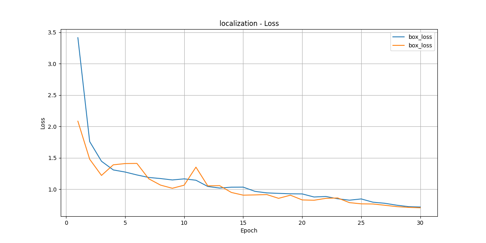
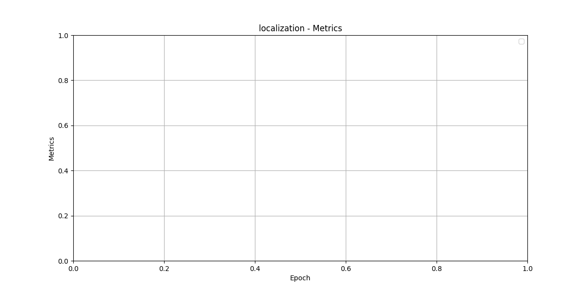
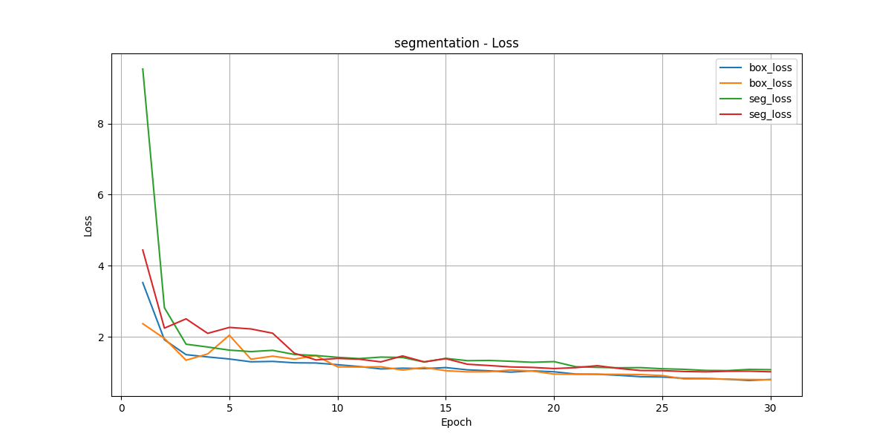

# Automatic Detection of Septal Bounce in Cine Cardiac MRI

## Overview

This repository provides an AI-based approach for the automatic detection of septal bounce, a distinctive feature of constrictive pericarditis, using YOLO-based segmentation and localization, along with optical flow-based biomarker extraction from cine cardiac MRI (CMRI).

## Objective

Automate the detection of septal bounce in CMRI, reducing the subjectivity and manual effort involved in traditional diagnostic practices.

## Methodology

- **YOLOv8** (Segmentation & Localization):
  - Segmenting the interventricular septum.
  - Localization through bounding box and polygon masks.

- **Optical Flow-Based Feature Extraction**:
  - Inversion Frequency (zero-crossings in displacement).
  - Peak Displacement Ratio (inward-to-outward displacement).
  - Bounce Energy Index.
  - Volume Variance.

- **Classification**:
  - Support Vector Machine (SVM) classifier distinguishes normal versus abnormal septal motion based on extracted features.

## Results (from provided study)

- YOLO segmentation achieved:
  - Precision: 0.752
  - Recall: 0.788
  - mAP@0.5: 0.811
  - mAP@0.5:0.95: 0.616

- SVM classifier achieved >90% sensitivity and specificity.

## Visualization of Training Metrics

### Localization Model Loss


### Localization Model Metrics


### Segmentation Model Loss


### Segmentation Model Metrics


## Repository Structure

```
/project_root
│── data/
│   ├── YOLO_SEGMENTATION/
│   └── YOLO_LOCALIZATION/
├── results/
│   └── visualization/
├── code/
│   ├── main.py
│   └── utils.py
├── paper/
│   └── abs_optical.docx
└── README.md
```

## Running the Project

### Prerequisites

- Python >= 3.7
- PyTorch
- ultralytics (YOLO)
- OpenCV
- pandas
- matplotlib

### Installation

Install dependencies using:
```sh
pip install ultralytics opencv-python pandas matplotlib
```

### Usage

Run the main script to train the models and visualize results:
```sh
python code/main.py
```

Generated visualizations and training metrics will be stored in the `results` directory.

## Reference

Please refer to the paper in `paper/abs_optical.docx` for a detailed scientific background and methodology.

## Keywords

- Septal Bounce
- Cine Cardiac MRI
- YOLOv8
- Optical Flow
- AI in Medical Imaging
- Constrictive Pericarditis
